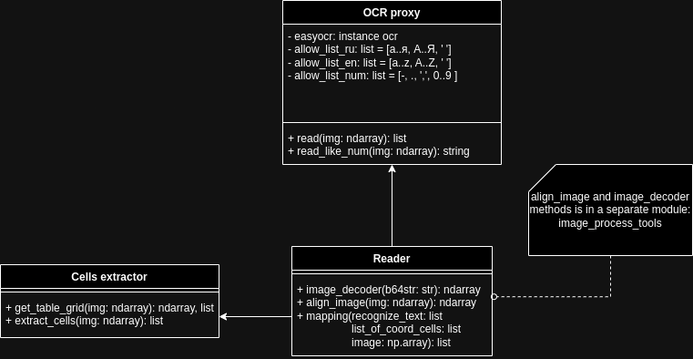

<h1>Table recognition</h1>

For work need install the poppler-utils: <a href="https://pypi.org/project/pdf2image/">About install.</a>

<h2>Service REST API</h2>
Service API allows get coordinates cells received table and recognized table in 
json format.  
Service can process raster images and multi-page PDF files. 
All files must be converted to base64 string before sending to service.  
Body all requests must look like <b>{data: b64str}</b> 

<h3>API for images:</h3>
for get coordinates cells in table 
<code>POST: /controller/tablestruct/img</code> 

<b>return</b>: json like {page: [col1, col2, ...]} 
    - where col_i corresponds column in table and look like [bbox1, bbox2, ...]  
    - where bbox_i it bounding box cell.

for get recognized table  
<code>POST: /controller/recognise/easyocr/img </code>  
<b>return</b>: json like {col_title1: [val1, val2, ...], col_title2: ...}  

<h3>API for PDF:</h3>
for get coordinates cells in table 
<code>POST: /controller/tablestruct/pdf</code> 

<b>return</b>: json like {pages: [page1, page2, ...]} 
    - where page_i it [col1, col2, ...]  
    - where col_i corresponds column in table and look like [bbox1, bbox2, ...]  
    - where bbox_i it bounding box cell.

for get recognized table  
<code>POST: /controller/recognise/easyocr/pdf</code>  
<b>return</b>:: json like {tables: [tab1, tab2, ...], col_title2: ...}  
    - where tab_i it json like {col_title1: [val1, val2, ...], col_title2: ...}  

<h2>Reader API documentation</h2>

 
OCR module based on EasyOCR <a href="https://www.jaided.ai/easyocr/documentation/">Doc</a>. 

<b><u>CLASS: EasyOcrProxy(read_param, **kwarg):</u></b> 
Create instance easyocr, defines set allowed characters: [0..9, a..z, A..Z, а..я, А..Я, -, '.', ','] 
<b>parameters:</b> 
    - read_param: look <a href="https://www.jaided.ai/easyocr/documentation/">EasyOCR doc</a> (readtext method)  
    - **kwarg: model parameters, look <a href="https://www.jaided.ai/easyocr/documentation/">EasyOCR doc</a> (Reader)  
    <b>methods</b>: 
    <b>read(img):</b> img -- ndarray 
    return: list like [([bbox_coord], text, confidence), ...] where  
    - <i>bbox_coord</i> is bounding box recognized text 
    - <i>test</i> is recognized text 
    - <i>confidence</i> is value between 0 and 1 -- confidence model 
    <b>read_like_num(img):</b> img -- ndarray. Can read only numbers. 
    return: string -- number recognized from image. 

<b><u>CLASS: CellExtractor():</u></b> 
Class for work with table structure. 
<b>methods:</b> 
<b>get_table_grid(image):</b> image -- ndarray. IMPORTANT! Image must be aligned! Lines of table must be parallel image borders 
return: grid, contours, where 
    - grid is ndarray -- binary image of table 
    - contours is list, look cv2 <a href="https://docs.opencv.org/4.x/d3/dc0/group__imgproc__shape.html#gadf1ad6a0b82947fa1fe3c3d497f260e0">doc</a>
    (find contours) 
<b>extract_cells(img)</b>: img -- ndarray, bytes, base64 string. IMPORTANT! Image must be aligned! Lines of table must be parallel image borders 
    return: list like [col1, col3, ...], where each col is list of bounding boxs cells in table 

<b><u>CLASS Reader(**kwargs):</u></b> 
Main class, get image with table, extracting table structure and recognize her. 
<b>parameters:</b> 
    - **kwarg: model parameters, look <a href="https://www.jaided.ai/easyocr/documentation/">EasyOCR doc</a> (Reader)  
<b>methods:</b> 
<b>read(img):</b> img -- ndarray or string in base64.  
return: recognize table like dictionary {col_title1: [val1, val2, ...], col_title2: ...}  

    